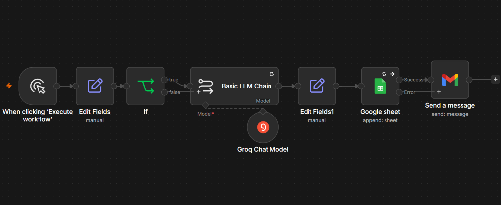
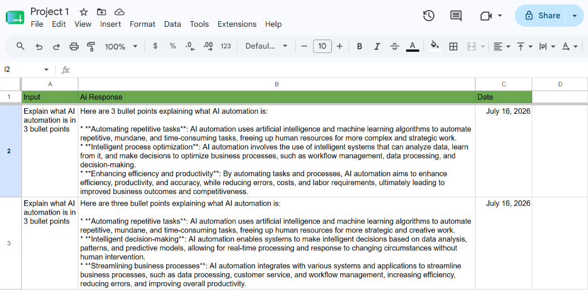
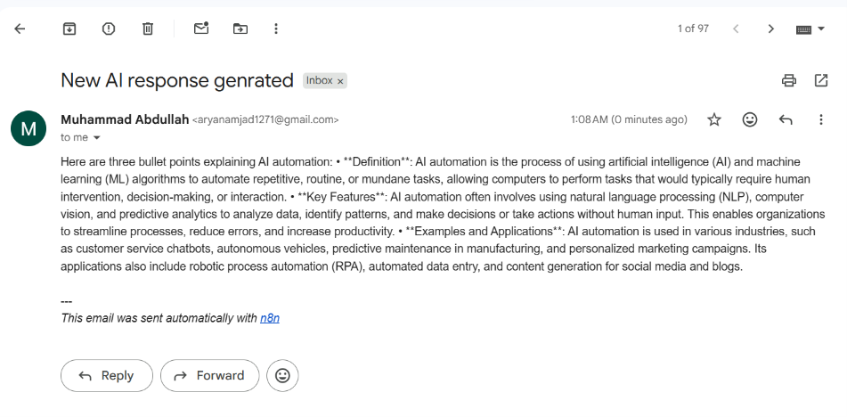

# 📝 Project 1: Text to AI Sheet

A simple n8n automation that sends a prompt to an AI model, saves the response into Google Sheets, and emails the result — demonstrating a full AI-to-storage-to-delivery pipeline.

---

## 📌 What This Project Does

This workflow takes a prompt — *"What is AI automation?"* — sends it to an LLM, and automatically:
1. Saves the input, AI response, and date into a Google Sheet (3 columns)
2. Sends the same AI-generated response to a Gmail account

A small end-to-end example of connecting an LLM to real-world storage and communication tools.

---

## ⚙️ How It Works (Workflow)

---

## 🛠️ Tech Stack

| Tool | Purpose |
|------|---------|
| **n8n** | Workflow automation |
| **Groq API (llama-3.3-70b-versatile)** | AI response generation |
| **Google Sheets** | Data storage (Input, AI Response, Date) |
| **Gmail** | Delivery of the AI response |

---

## 📷 Screenshots

*Full n8n workflow canvas*

*Data saved in Google Sheets*

*Email received with the AI response*

---

## 🎯 What I Learned

- How to connect an LLM node to other automation nodes
- How to structure and save AI-generated data into Google Sheets
- How to trigger an email send as the final step of a workflow

---

## 👤 Author

Built by Abdullah as part of a self-directed AI Automation learning program.
